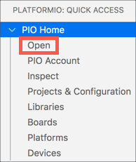
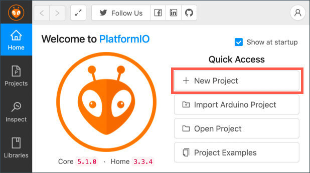
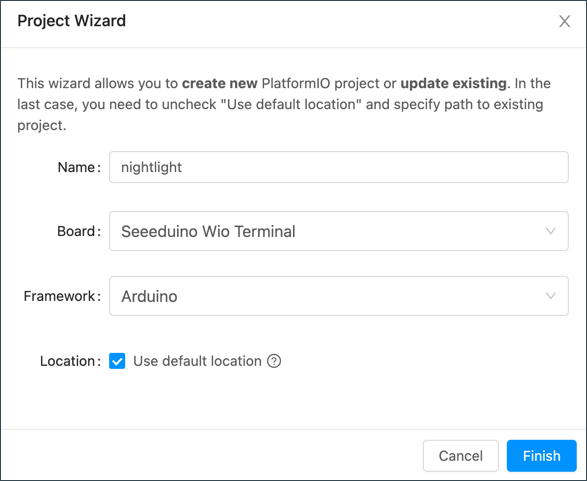

# Wio Terminal

O [Wio Terminal da Seeed Studios] (https://www.seeedstudio.com/Wio-Terminal-p-4509.html) é um microcontrolador compatível com Arduino, com WiFi e alguns sensores e atuadores integrados, bem como portas para adicionar mais sensores e atuadores, usando um ecossistema de hardware chamado [Grove] (https://www.seeedstudio.com/category/Grove-c-1003.html).


## Configuração

Para usar o Wio Terminal, você precisará instalar algum software gratuito no computador. Você também precisará atualizar o firmware do Wio Terminal antes de conectá-lo ao WiFi.

### Tarefa - configuração

Instale o software necessário e atualize o firmware.

1. Instale o Visual Studio Code (VS Code). Este é o editor que você usará para escrever o código do seu dispositivo em C/C++. Consulte a [documentação do VS Code](https://code.visualstudio.com?WT.mc_id=academic-17441-jabenn) para obter instruções sobre como instalar o VS Code.

    > 💁 Outro IDE popular para o desenvolvimento do Arduino é o [Arduino IDE](https://www.arduino.cc/en/software). Se você já está familiarizado com esta ferramenta, você pode usá-la em vez do VS Code e PlatformIO, mas as lições darão instruções baseadas no uso do VS Code.

1. Instale a extensão PlatformIO do VS Code. Esta é uma extensão do VS Code que oferece suporte à programação de microcontroladores em C/C++. Consulte a [documentação da extensão PlatformIO](https://marketplace.visualstudio.com/items?itemName=platformio.platformio-ide&WT.mc_id=academic-17441-jabenn) para obter instruções sobre como instalar esta extensão no VS Code. Esta extensão depende da extensão Microsoft C/C++ para funcionar com código C e C ++, e a extensão C/C++ é instalada automaticamente quando você instala a extensão PlatformIO.

1. Conecte o Wio Terminal ao computador. O Wio Terminal possui uma porta USB-C na parte inferior e ela precisa ser conectada a uma porta USB no seu computador. O Wio Terminal vem com um cabo USB-C para USB-A, mas se o seu computador tiver apenas portas USB-C, você precisará de um cabo USB-C ou de um adaptador USB-A para USB-C.

1. Siga as instruções na [documentação de visão geral de WiFi da Wiki do Wio Terminal](https://wiki.seeedstudio.com/Wio-Terminal-Network-Overview/) para configurar seu Wio Terminal e atualizar o firmware.

## Hello World

É tradicional, ao começar com uma nova linguagem de programação ou tecnologia, criar um aplicativo 'Hello World' - um pequeno aplicativo que produz algo como o texto `"Hello World"` para mostrar que todas as ferramentas estão configuradas corretamente.

O aplicativo Hello World para o Wio Terminal garantirá que você tenha o Visual Studio Code instalado corretamente com PlatformIO e configurado para desenvolvimento de microcontrolador.

### Crie um projeto PlatformIO

A primeira etapa é criar um novo projeto usando PlatformIO configurado para o Wio Terminal.

#### Tarefa - criar um projeto PlatformIO

Crie o projeto PlatformIO.

1. Conecte o Wio Terminal ao seu computador

1. Inicie o VS Code

1. O ícone PlatformIO estará na barra de menu lateral:

    

    Selecione este item de menu e, em seguida, selecione *PIO Home -> Open*

    

1. Na tela de boas-vindas, selecione o botão **+ New Project**

    

1. Configure o projeto no *Project Wizard*:

    1. Nomeie seu projeto como `nightlight`

    1. No dropdown de *Board*, digite `WIO` para filtrar as placas e selecione *Seeeduino Wio Terminal*

    1. Deixe o *Framework* como *Arduino*

    1. Deixe a caixa de seleção *Use default location* marcada, ou desmarque-a e selecione um local para o seu projeto

    1. Selecione o botão **Finish**

    

    PlatformIO baixará os componentes necessários para compilar o código para o Wio Terminal e criar seu projeto. Isso pode levar alguns minutos.

### Investigue o projeto PlatformIO

O explorador do VS Code mostrará vários arquivos e pastas criados pelo assistente PlatformIO.

#### Pastas

* `.pio` - esta pasta contém dados temporários necessários para PlatformIO, como bibliotecas ou código compilado. Ela é recriada automaticamente se excluída e você não precisa adicioná-la ao controle do código-fonte se estiver compartilhando seu projeto em sites como o GitHub.
* `.vscode` - esta pasta contém a configuração usada por PlatformIO e VS Code. Ela é recriada automaticamente se excluída e você não precisa adicioná-la ao controle do código-fonte se estiver compartilhando seu projeto em sites como o GitHub.
* `include` - esta pasta é para arquivos de cabeçalho externos necessários ao adicionar bibliotecas adicionais ao seu código. Você não usará esta pasta em nenhuma dessas lições.
* `lib` - esta pasta é para bibliotecas externas que você deseja chamar de seu código. Você não usará esta pasta em nenhuma dessas lições.
* `src` - esta pasta contém o código-fonte principal do seu aplicativo. Inicialmente, ele conterá um único arquivo - `main.cpp`.
* `test` - esta pasta é onde você colocaria quaisquer testes de unidade para o seu código

#### Arquivos

* `main.cpp` - este arquivo na pasta `src` contém o ponto de entrada para sua aplicação. Abra este arquivo e ele conterá o seguinte código:

    ```cpp
    #include <Arduino.h>
    
    void setup() {
      // coloque seu código de configuração aqui, para ser executado uma vez:
    }
    
    void loop() {
      // coloque seu código principal aqui, para executar repetidamente:
    }
    ```

    Quando o dispositivo é inicializado, a estrutura do Arduino executará a função `setup` uma vez e, em seguida, executará a função `loop` repetidamente até que o dispositivo seja desligado.

* `.gitignore` - este arquivo lista os arquivos e diretórios a serem ignorados ao adicionar seu código ao controle de código-fonte do git, como enviar para um repositório no GitHub.

* `platformio.ini` - este arquivo contém a configuração para seu dispositivo e aplicativo. Abra este arquivo e ele conterá o seguinte código:

    ```ini
    [env:seeed_wio_terminal]
    platform = atmelsam
    board = seeed_wio_terminal
    framework = arduino
    ```

    A seção `[env:seeed_wio_terminal]` tem configuração para o Wio Terminal. Você pode ter várias seções `env` para que seu código possa ser compilado para várias placas.

    Os outros valores correspondem à configuração do assistente de projeto:

  * `platform = atmelsam` define o hardware que o Wio Terminal usa (um microcontrolador baseado em ATSAMD51)
  * `board = seeed_wio_terminal` define o tipo de placa do microcontrolador (o Wio Terminal)
  * `framework = arduino` define que este projeto está usando o framework Arduino.

### Escreva o aplicativo Hello World

Agora você está pronto para escrever o aplicativo Hello World.

#### Tarefa - escrever o aplicativo Hello World

Escreva o aplicativo Hello World.

1. Abra o arquivo `main.cpp` no VS Code

1. Altere o código para corresponder ao seguinte:

    ```cpp
    #include <Arduino.h>

    void setup()
    {
        Serial.begin(9600);

        while (!Serial)
            ; // Aguarde até que o Serial esteja pronto
    
        delay(1000);
    }
    
    void loop()
    {
        Serial.println("Hello World");
        delay(5000);
    }
    ```

    A função `setup` inicializa uma conexão com a porta serial - neste caso, a porta USB que é usada para conectar o Wio Terminal ao seu computador. O parâmetro `9600` é a [taxa de transmissão](https://wikipedia.org/wiki/Symbol_rate) (também conhecida como taxa de símbolo), ou velocidade com que os dados serão enviados pela porta serial em bits por segundo. Essa configuração significa que 9.600 bits (0s e 1s) de dados são enviados a cada segundo. Em seguida, ele espera que a porta serial esteja pronta.

    A função `loop` envia a linha `Hello World!` para a porta serial, então os caracteres de `Hello World!` junto com um caractere de nova linha. Em seguida, ele dorme por 5.000 milissegundos ou 5 segundos. Depois que o `loop` termina, ele é executado novamente, e novamente, e assim por diante, o tempo todo em que o microcontrolador permanece ligado.

1. Construa e carregue o código para o Wio Terminal

    1. Abra a paleta de comando do VS Code

    1. Digite `PlatformIO Upload` para pesquisar a opção de upload e selecione *PlatformIO: Upload*

        

        PlatformIO construirá automaticamente o código, se necessário, antes de fazer o upload.

    1. O código será compilado e enviado para o Wio Terminal

        > 💁 Se você estiver usando o macOS, será exibida uma notificação sobre um *DISCO NÃO EJETADO CORRETAMENTE*. Isso ocorre porque o Wio Terminal é montado como uma unidade como parte do processo de flashing e é desconectado quando o código compilado é gravado no dispositivo. Você pode ignorar esta notificação.

    ⚠️ Se você receber erros sobre a porta de upload não estar disponível, primeiro certifique-se de ter o Wio Terminal conectado ao seu computador e ligado usando o botão no lado esquerdo da tela. A luz verde na parte inferior deve estar acesa. Se você ainda receber o erro, puxe o botão liga/desliga para baixo duas vezes em rápida sucessão para forçar o Wio Terminal no modo bootloader e tente fazer o upload novamente.

PlatformIO tem um monitor serial que pode monitorar os dados enviados pelo cabo USB do Wio Terminal. Isso permite que você monitore os dados enviados pelo comando `Serial.println("Hello World");`.

1. Abra a paleta de comando do VS Code

1. Digite `PlatformIO Serial` para pesquisar a opção Serial Monitor e selecione *PlatformIO: Serial Monitor*

    

    Um novo terminal será aberto e os dados enviados pela porta serial serão transmitidos para este terminal:

    ```output
    > Executing task: platformio device monitor <
    
    --- Available filters and text transformations: colorize, debug, default, direct, hexlify, log2file, nocontrol, printable, send_on_enter, time
    --- More details at http://bit.ly/pio-monitor-filters
    --- Miniterm on /dev/cu.usbmodem101  9600,8,N,1 ---
    --- Quit: Ctrl+C | Menu: Ctrl+T | Help: Ctrl+T followed by Ctrl+H ---
    Hello World
    Hello World
    ```

    `Hello World` será impresso no monitor serial a cada 5 segundos.

> 💁 Você pode encontrar este código na pasta [code/wio-terminal](../code/wio-terminal).

😀 Seu programa 'Hello World' foi um sucesso!