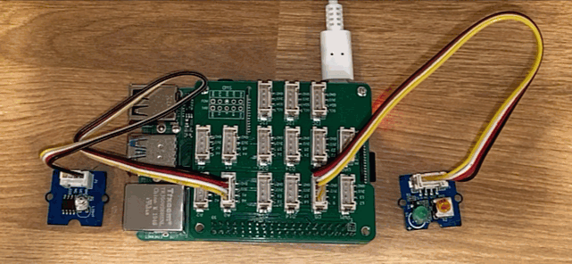

# Créer une veilleuse - Raspberry Pi

Dans cette partie de la leçon, vous allez ajouter une LED à votre Raspberry Pi et l'utiliser pour créer une veilleuse.

## Matériel

La veilleuse a maintenant besoin d'un actionneur.

L'actionneur est une **LED**, une [diode électroluminescente](https://wikipedia.org/wiki/Light-emitting_diode) qui émet de la lumière lorsqu'elle est traversée par un courant. Il s'agit d'un actionneur numérique qui a deux états, marche et arrêt (`on` et `off` en anglais). L'envoi d'une valeur de 1 allume la LED et celle de 0 l'éteint. La LED est un actionneur Grove externe et doit être connectée au chapeau Grove Base du Raspberry Pi.

La logique de la veilleuse en pseudo-code est la suivante :

```sortie
Vérifier le niveau de lumière.
Si la lumière est inférieure à 300
    Allumer la LED
Sinon
    Eteindre la LED
```

### Connecter la LED

Le Grove LED se présente sous la forme d'un module avec une sélection de LED, ce qui vous permet de choisir la couleur.

#### Tâche - connecter la LED

Connectez la LED.


1. Choisissez votre LED préférée et insérez les pattes dans les deux trous du module LED.

    Les LEDs sont des diodes électroluminescentes, et les diodes sont des dispositifs électroniques qui ne peuvent transporter le courant que dans un sens. Cela signifie que la LED doit être connectée dans le bon sens, sinon elle ne fonctionnera pas.

    L'une des pattes de la LED est la broche positive, l'autre est la broche négative. La LED n'est pas parfaitement ronde et est légèrement plus plate d'un côté. Le côté légèrement plus plat est la broche négative. Lorsque vous connectez la LED au module, assurez-vous que la broche du côté arrondi est connectée à la prise marquée **+** à l'extérieur du module, et que le côté plus plat est connecté à la prise plus proche du milieu du module.

1. Le module LED est doté d'un bouton rotatif qui vous permet de contrôler la luminosité. Pour commencer, réglez-le à fond en le tournant dans le sens inverse des aiguilles d'une montre jusqu'à la butée à l'aide d'un petit tournevis cruciforme.

1. Insérez l'une des extrémités d'un câble Grove dans la prise du module LED. Il ne peut être inséré que dans un seul sens.

1. Le Raspberry Pi étant hors tension, connectez l'autre extrémité du câble Grove à la prise numérique marquée **D5** sur le chapeau de base Grove attaché au Pi. Cette prise est la deuxième en partant de la gauche, sur la rangée de prises à côté des broches GPIO.


## Programmer la veilleuse

La veilleuse peut maintenant être programmée à l'aide du capteur de lumière Grove et de la LED Grove.

### Tâche - programmer la veilleuse

Programmez la veilleuse.

1. Allumez le Pi et attendez qu'il démarre

1. Ouvrez le projet nightlight que vous avez créé dans la partie précédente de ce travail dans VS Code, soit en l'exécutant directement sur le Pi, soit en le connectant à l'aide de l'extension Remote SSH.

1. Ajoutez le code suivant au fichier `app.py` pour vous connecter à l'importation d'une bibliothèque requise. Il doit être ajouté en haut, en dessous des autres lignes `import`.

    ```python
    from grove.grove_led import GroveLed
    ```

    L'instruction `from grove.grove_led import GroveLed` importe la bibliothèque `GroveLed` des bibliothèques Grove Python. Cette bibliothèque contient du code pour interagir avec une LED Grove.

1. Ajoutez le code suivant après la déclaration `light_sensor` pour créer une instance de la classe qui gère la LED :

    ```python
    led = GroveLed(5)
    ```

    La ligne `led = GroveLed(5)` crée une instance de la classe `GroveLed` qui se connecte à la broche **D5** - la broche digitale Grove à laquelle la LED est connectée.

    > 💁 Toutes les prises ont des numéros de broches uniques. Les broches 0, 2, 4 et 6 sont des broches analogiques, les broches 5, 16, 18, 22, 24 et 26 sont des broches numériques.

1. Ajoutez une vérification à l'intérieur de la boucle `while`, et avant le `time.sleep` pour vérifier les niveaux de lumière et allumer ou éteindre la LED :

    ```python
    if light < 300:
        led.on()
    else:
        led.off()
    ```

    Ce code vérifie la valeur de `light`. Si elle est inférieure à 300, il appelle la méthode `on` de la classe `GroveLed` qui envoie une valeur numérique de 1 à la LED, l'allumant ainsi. Si la valeur de la lumière est supérieure ou égale à 300, il appelle la méthode `off`, qui envoie une valeur numérique de 0 à la LED, pour l'éteindre.

    > 💁 Ce code doit être indenté au même niveau que la ligne `print('Light level:', light)` pour être à l'intérieur de la boucle while !

    > 💁 Lors de l'envoi de valeurs numériques à des actionneurs, une valeur 0 correspond à 0V, et une valeur 1 correspond à la tension maximale de l'appareil. Pour le Raspberry Pi avec les capteurs et actionneurs Grove, la tension 1 est de 3,3V.

1. Depuis le terminal VS Code, exécutez ce qui suit pour lancer votre application Python :

    ```sh
    python3 app.py
    ```

    Les valeurs de lumière seront affichées dans la console.

    ```output
    pi@raspberrypi:~/nightlight $ python3 app.py 
    Light level: 634
    Light level: 634
    Light level: 634
    Light level: 230
    Light level: 104
    Light level: 290
    ```

1. Couvrez et découvrez le capteur de lumière. Remarquez que la LED s'allume si le niveau de lumière est inférieur ou égal à 300, et s'éteint lorsque le niveau de lumière est supérieur à 300.

    > 💁 Si la LED ne s'allume pas, assurez-vous qu'elle est connectée dans le bon sens et que le bouton de rotation est réglé sur "full on".



> 💁 Vous trouverez ce code dans le dossier [code-actuator/pi](code-actuator/pi).

😀 Votre programme de veilleuse est un succès!
