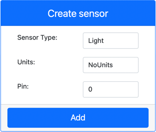
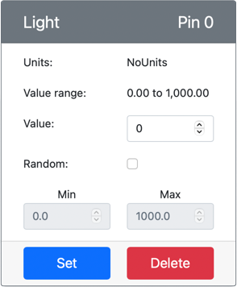

# Build a nightlight - Virtual IoT Hardware

In this part of the lesson, you will add a light sensor to your virtual IoT device.

## Virtual Hardware

The nightlight needs one sensor, created in the CounterFit app.

The sensor is a **light sensor**. In a physical IoT device, it would be a [photodiode](https://wikipedia.org/wiki/Photodiode) that converts light to an electrical signal. Light sensors are analog sensors that sends an integer value indicating a relative amount of light, that doesn't map to any standard unit of measurement such as [lux](https://wikipedia.org/wiki/Lux).

### Add the sensors to CounterFit

To use a virtual light sensor, you need to add it to the CounterFit app

#### Task - add the sensors to CounterFit

Add the light sensor to the CounterFit app.

1. Make sure the CounterFit web app is running from the previous part of this assignment. If not, start it.

1. Create a light sensor:

    1. In the *Create sensor* box in the *Sensors* pane, drop down the *Sensor type* box and select *Light*.

    1. Leave the *Units* set to *NoUnits*

    1. Ensure the *Pin* is set to *0*

    1. Select the **Add** button to create the light sensor on Pin 0

    

    The light sensor will be created and appear in the sensors list.

    

## Program the light sensor

The device can now be programmed to use the built in light sensor.

### Task - program the light sensor

Program the device.

1. Open the nightlight project in VS Code that you created in the previous part of this assignment. Kill and re-create the terminal to ensure it is running using the virtual environment if necessary.

1. Open the `app.py` file

1. Add the following code to the top of `app.py` file with the rest of the `import` statements to connect to import some required libraries:

    ```python
    import time
    from counterfit_shims_grove.grove_light_sensor_v1_2 import GroveLightSensor
    ```

    The `import time` statement imports the Python `time` module that will be used later in this assignment.

    The `from counterfit_shims_grove.grove_light_sensor_v1_2 import GroveLightSensor` statement imports the `GroveLightSensor` from the CounterFit Grove shim Python libraries. This library has code to interact with a light sensor created in the CounterFit app.

1. Add the following code to the bottom of the file to create instances of classes that manage the light sensor:

    ```python
    light_sensor = GroveLightSensor(0)
    ```

    The line `light_sensor = GroveLightSensor(0)` creates an instance of the `GroveLightSensor` class connecting to pin **0** - the CounterFit Grove pin that the light sensor is connected to.

1. Add an infinite loop after the code above to poll the light sensor value and print it to the console:

    ```python
    while True:
        light = light_sensor.light
        print('Light level:', light)
    ```

    This will read the current light level using the `light` property of the `GroveLightSensor` class. This property reads the analog value from the pin. This value is then printed to the console.

1. Add a small sleep of one second at the end of the `while` loop as the light levels don't need to be checked continuously. A sleep reduces the power consumption of the device.

    ```python
    time.sleep(1)
    ```

1. From the VS Code Terminal, run the following to run your Python app:

    ```sh
    python3 app.py
    ```

    You should see light values being output to the console. Initially this value will be 0.

1. From the CounterFit app, change the value of the light sensor that will be read by the app. You can do this in one of two ways:

    * Enter a number in the *Value* box for the light sensor, then select the **Set** button. The number you enter will be the value returned by the sensor.

    * Check the *Random* checkbox, and enter a *Min* and *Max* value, then select the **Set** button. Every time the sensor reads a value, it will read a random number between *Min* and *Max*.

    You should see the values you set appearing in the console. Change the *Value* or the *Random* settings to see the value change.

    ```output
    (.venv) ➜  GroveTest python3 app.py 
    Light level: 143
    Light level: 244
    Light level: 246
    Light level: 253
    ```

> 💁 You can find this code in the [code-sensor/virtual-device](code-sensor/virtual-device) folder.

😀 Your nightlight program was a success!
