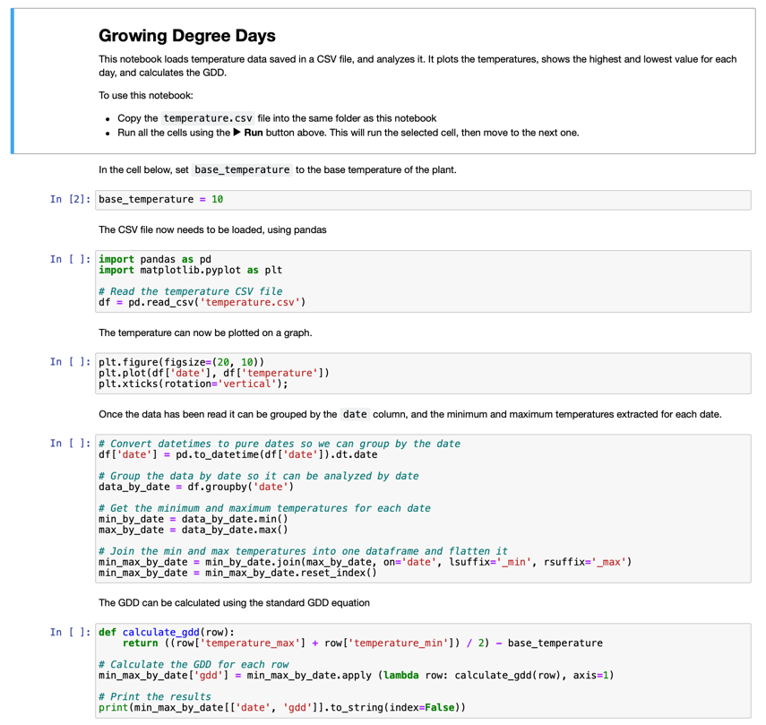

# Visualize GDD data using a Jupyter Notebook

## Instructions

In this lesson you gathered GDD data using an IoT sensor. To get good GDD data, you need to gather data for multiple days. To help visualize temperature data and calculate GDD you can use tools like [Jupyter Notebooks](https://jupyter.org) to analyze the data.

Start by gathering data for a few days. You will need to ensure your server code is running all the time your IoT device is running, either by adjusting your power management settings or running something like [this keep system active Python script](https://github.com/jaqsparow/keep-system-active).

Once you have temperature data, you can use the Jupyter Notebook in this repo to visualize it and calculate GDD. Jupyter notebooks mix code and instructions in blocks called *cells*, often code in Python. You can read the instructions, then run each block of code, block by block. You can also edit the code. In this notebook for example, you can edit the base temperature used to calculate the GDD for your plant.

1. Create a folder called `gdd-calculation`

1. Download the [gdd.ipynb](./code-notebook/gdd.ipynb) file and copy it into the `gdd-calculation` folder.

1. Copy the `temperature.csv` file created by the MQTT server

1. Create a new Python virtual environment in the `gdd-calculation` folder.

1. Install some pip packages for Jupyter notebooks, along with libraries needed to manage and plot the data:

    ```sh
    pip install -U pip
    pip install pandas
    pip install matplotlib
    pip install jupyter
    ```

1. Run the notebook in Jupyter:

    ```sh
    jupyter notebook gdd.ipynb
    ```

    Jupyter will start up and open the notebook in your browser. Work through the instructions in the notebook to visualize the temperatures measured, and calculate the growing degree days.

    

## Rubric

| Criteria | Exemplary | Adequate | Needs Improvement |
| -------- | --------- | -------- | ----------------- |
| Capture data | Capture at least 2 complete days of data | Capture at least 1 complete day of data | Capture some data |
| Calculate GDD | Successfully run the notebook and calculate GDD | Successfully run the notebook | Not able to run the notebook |
