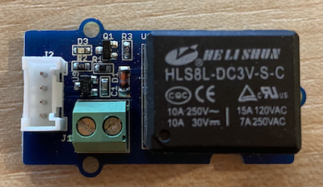
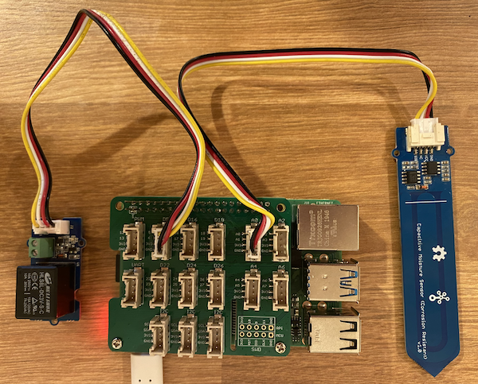
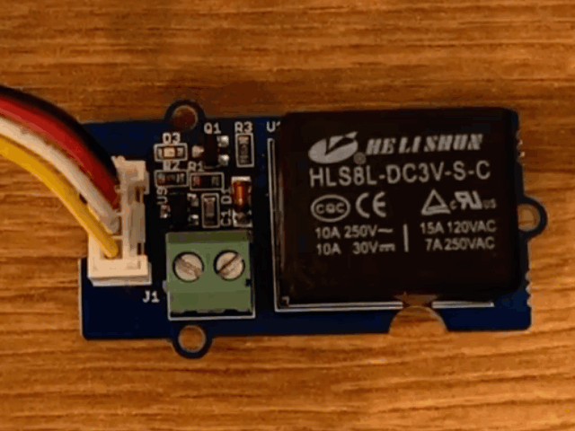

# Control a relay - Raspberry Pi

In this part of the lesson, you will add a relay to your Raspberry Pi in addition to the soil moisture sensor, and control it based off the soil moisture level.

## Hardware

The Raspberry Pi needs a relay.

The relay you'll use is a [Grove relay](https://www.seeedstudio.com/Grove-Relay.html), a normally-open relay (meaning the output circuit is open, or disconnected when there is no signal sent to the relay) that can handle output circuits up to 250V and 10A.

This is a digital actuator, so connects to a digital pin on the Grove Base Hat.

### Connect the relay

The Grove relay can be connected to the Raspberry Pi.

#### Task

Connect the relay.



1. Insert one end of a Grove cable into the socket on the relay. It will only go in one way round.

1. With the Raspberry Pi powered off, connect the other end of the Grove cable to the digital socket marked **D5** on the Grove Base hat attached to the Pi. This socket is the second from the left, on the row of sockets next to the GPIO pins. Leave the soil moisture sensor connected to the **A0** socket.



1. Insert the soil moisture sensor into soil, if it isn't already from the previous lesson.

## Program the relay

The Raspberry Pi can now be programmed to use the attached relay.

### Task

Program the device.

1. Power up the Pi and wait for it to boot

1. Open the `soil-moisture-sensor` project from the last lesson in VS Code if it's not already open. You will be adding to this project.

1. Add the following code to the `app.py` file below the existing imports:

    ```python
    from grove.grove_relay import GroveRelay
    ```

    This statement imports the `GroveRelay` from the Grove Python libraries to interact with the Grove relay.

1. Add the following code below the declaration of the `ADC` class to create a `GroveRelay` instance:

    ```python
    relay = GroveRelay(5)
    ```

    This creates a relay using pin **D5**, the digital pin you connected the relay to.

1. To test the relay is working, add the following to the `while True:` loop:

    ```python
    relay.on()
    time.sleep(.5)
    relay.off()
    ```

    The code turns the relay on, waits 0.5 seconds, then turns the relay off.

1. Run the Python app. The relay will turn on and off every 10 seconds, with a half second delay between turning on and off. You will hear the relay click on then click off. An LED on the Grove board will light when the relay is on, then go out when the relay is off.

    

## Control the relay from soil moisture

Now that the relay is working, it can be controlled in response to soil moisture readings.

### Task

Control the relay.

1. Delete the 3 lines of code that you added to test the relay. Replace them with the following code in its place:

    ```python
    if soil_moisture > 450:
        print("Soil Moisture is too low, turning relay on.")
        relay.on()
    else:
        print("Soil Moisture is ok, turning relay off.")
        relay.off()
    ```

    This code checks the soil moisture level from the soil moisture sensor. if it is above 450, it turns on the relay, turning it off if it goes below 450.

    > 💁 Remember the capacitive soil moisture sensor reads lower the more moisture there is in the soil.

1. Run the Python app. You will see the relay turn on or off depending on the soil moisture levels. Try in dry soil, then add water.

    ```output
    Soil Moisture: 638
    Soil Moisture is too low, turning relay on.
    Soil Moisture: 452
    Soil Moisture is too low, turning relay on.
    Soil Moisture: 347
    Soil Moisture is ok, turning relay off.
    ```

> 💁 You can find this code in the [code-relay/pi](code-relay/pi) folder.

😀 Your soil moisture sensor controlling a relay program was a success!
