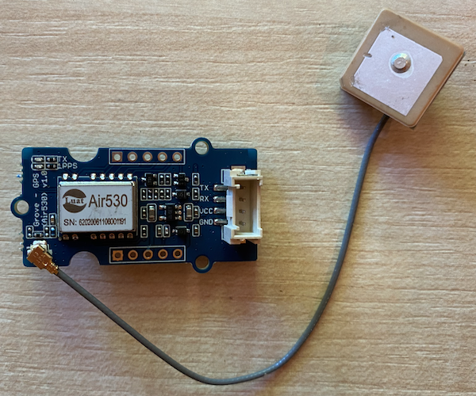
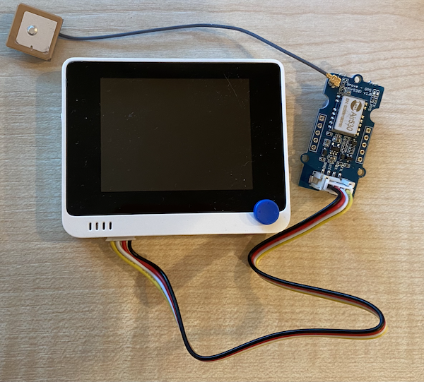

# Read GPS data - Wio Terminal

In this part of the lesson, you will add a GPS sensor to your Wio Terminal, and read values from it.

## Hardware

The Wio Terminal needs a GPS sensor.

The sensor you'll use is a [Grove GPS Air530 sensor](https://www.seeedstudio.com/Grove-GPS-Air530-p-4584.html). This sensor can connect to multiple GPS systems for a fast, accurate fix. The sensor is made of 2 parts - the core electronics of the sensor, and an external antenna connected by a thin wire to pick up the radio waves from the satellites.

This is a UART sensor, so sends GPS data over UART.

### Connect the GPS sensor

The Grove GPS sensor can be connected to the Wio Terminal.

#### Task - connect the GPS sensor

Connect the GPS sensor.



1. Insert one end of a Grove cable into the socket on the GPS sensor. It will only go in one way round.

1. With the Wio Terminal disconnected from your computer or other power supply, connect the other end of the Grove cable to the left-hand side Grove socket on the Wio Terminal as you look at the screen. This is the socket closest to from the power button.



1. Position the GPS sensor so that the attached antenna has visibility to the sky - ideally next to an open window or outside. It's easier to get a clearer signal with nothing in the way of the antenna.

1. You can now connect the Wio Terminal to your computer.

1. The GPS sensor has 2 LEDs - a blue LED that flashes when data is transmitted, and a green LED that flashes every second when receiving data from satellites. Ensure the blue LED is flashing when you power up the Pi. After a few minutes the green LED will flash - if not, you may need to reposition the antenna.

## Program the GPS sensor

The Wio Terminal can now be programmed to use the attached GPS sensor.

### Task - program the GPS sensor

Program the device.

1. Create a brand new Wio Terminal project using PlatformIO. Call this project `gps-sensor`. Add code in the `setup` function to configure the serial port.

1. Add the following include directive to the top of the `main.cpp` file. This includes a header file with functions to configure the left-hand Grove port for UART.

    ```cpp
    #include <wiring_private.h>
    ```

1. Below this, add the following line of code to declare a serial port connection to the UART port:

    ```cpp
    static Uart Serial3(&sercom3, PIN_WIRE_SCL, PIN_WIRE_SDA, SERCOM_RX_PAD_1, UART_TX_PAD_0);
    ```

1. You need to add some code to redirect some internal signal handlers to this serial port. Add the following code below the `Serial3` declaration:

    ```cpp
    void SERCOM3_0_Handler()
    {
        Serial3.IrqHandler();
    }
    
    void SERCOM3_1_Handler()
    {
        Serial3.IrqHandler();
    }
    
    void SERCOM3_2_Handler()
    {
        Serial3.IrqHandler();
    }
    
    void SERCOM3_3_Handler()
    {
        Serial3.IrqHandler();
    }
    ```

1. In the `setup` function below where the `Serial` port is configured, configure the UART serial port with the following code:

    ```cpp
    Serial3.begin(9600);

    while (!Serial3)
        ; // Wait for Serial3 to be ready

    delay(1000);
    ```

1. Below this code in the `setup` function, add the following code to connect the Grove pin to the serial port:

    ```cpp
    pinPeripheral(PIN_WIRE_SCL, PIO_SERCOM_ALT);
    ```

1. Add the following function before the `loop` function to send the GPS data to the serial monitor:

    ```cpp
    void printGPSData()
    {
        Serial.println(Serial3.readStringUntil('\n'));
    }
    ```

1. In the `loop` function, add the following code to read from the UART serial port and print the output to the serial monitor:

    ```cpp
    while (Serial3.available() > 0)
    {
        printGPSData();
    }
    
    delay(1000);
    ```

    This code reads from the UART serial port. The `readStringUntil` function reads up until a terminator character, in this case a new line. This will read a whole NMEA sentence (NMEA sentences are terminated with a new line character). All the while data can be read from the UART serial port, it is read and sent to the serial monitor via the `printGPSData` function. Once no more data can be read, the `loop` delays for 1 second (1,000ms).

1. Build and upload the code to the Wio Terminal.

1. Once uploaded, you can monitor the GPS data using the serial monitor.

    ```output
    > Executing task: platformio device monitor <
    
    --- Available filters and text transformations: colorize, debug, default, direct, hexlify, log2file, nocontrol, printable, send_on_enter, time
    --- More details at http://bit.ly/pio-monitor-filters
    --- Miniterm on /dev/cu.usbmodem1201  9600,8,N,1 ---
    --- Quit: Ctrl+C | Menu: Ctrl+T | Help: Ctrl+T followed by Ctrl+H ---
    $GNGGA,020604.001,4738.538654,N,12208.341758,W,1,3,,164.7,M,-17.1,M,,*67
    $GPGSA,A,1,,,,,,,,,,,,,,,*1E
    $BDGSA,A,1,,,,,,,,,,,,,,,*0F
    $GPGSV,1,1,00*79
    $BDGSV,1,1,00*68
    ```

> 💁 You can find this code in the [code-gps/wio-terminal](code-gps/wio-terminal) folder.

😀 Your GPS sensor program was a success!
