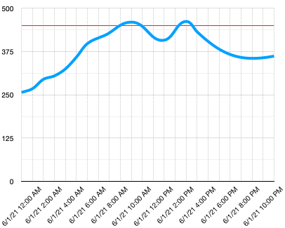
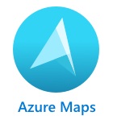
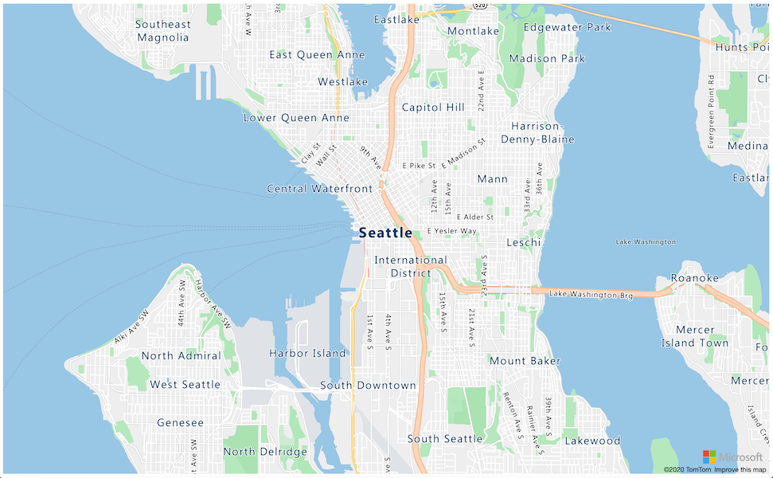
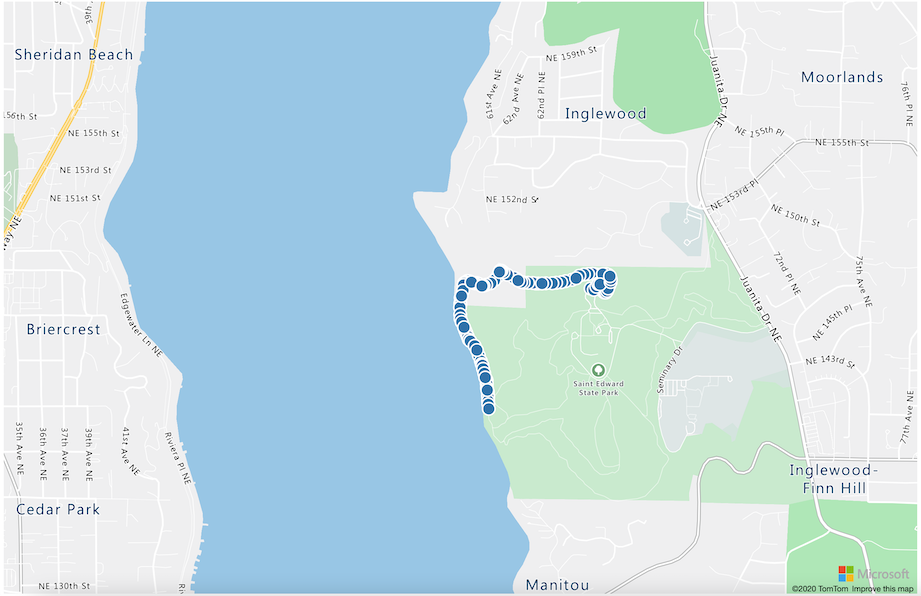

# Visualize location data

Add a sketchnote if possible/appropriate

This video gives an overview of OAzure Maps with IoT, a service that will be covered in this lesson.

[](https://www.youtube.com/watch?v=P5i2GFTtb2s)

> 🎥 Click the image above to watch the video

## Pre-lecture quiz

[Pre-lecture quiz](https://brave-island-0b7c7f50f.azurestaticapps.net/quiz/25)

## Introduction

In the last lesson you learned how to get GPS data from your sensors to save to the cloud in a storage container using serverless code. Now you will discover how to visualize those points on an Azure map. You will learn how to create a map on a web page, learn about the GeoJSON data format and how to use it to plot all the captured GPS points on your map.

In this lesson we'll cover:

* [What is data visualization](#what-is-data-visualization)
* [Map services](#map-services)
* [Create an Azure Maps resource](#create-an-azure-maps-resource)
* [Show a map on a web page](#show-a-map-on-a-web-page)
* [The GeoJSON format](#the-geojson-format)
* [Plot GPS data on a Map using GeoJSON](#plot-gps-data-on-a-map-using-geojson)

> 💁 This lesson will involve a small amount of HTML and JavaScript. If you would like to learn more about web development using HTML and JavaScript, check out [Web development for beginners](https://github.com/microsoft/Web-Dev-For-Beginners).

## What is data visualization

Data visualization, as the name suggests, is about visualizing data in ways that make it easier for humans to understand. It is usually associated with charts and graphs, but is any way of pictorially representing data to help humans to not only understand the data better, but help them make decisions.

Taking a simple example - back in the farm project you captured soil moisture settings. A table of soil moisture data captured every hour for the 1st June 2021 might be something like the following:

| Date             | Reading |
| ---------------- | ------: |
| 01/06/2021 00:00 |     257 |
| 01/06/2021 01:00 |     268 |
| 01/06/2021 02:00 |     295 |
| 01/06/2021 03:00 |     305 |
| 01/06/2021 04:00 |     325 |
| 01/06/2021 05:00 |     359 |
| 01/06/2021 06:00 |     398 |
| 01/06/2021 07:00 |     410 |
| 01/06/2021 08:00 |     429 |
| 01/06/2021 09:00 |     451 |
| 01/06/2021 10:00 |     460 |
| 01/06/2021 11:00 |     452 |
| 01/06/2021 12:00 |     420 |
| 01/06/2021 13:00 |     408 |
| 01/06/2021 14:00 |     431 |
| 01/06/2021 15:00 |     462 |
| 01/06/2021 16:00 |     432 |
| 01/06/2021 17:00 |     402 |
| 01/06/2021 18:00 |     387 |
| 01/06/2021 19:00 |     360 |
| 01/06/2021 20:00 |     358 |
| 01/06/2021 21:00 |     354 |
| 01/06/2021 22:00 |     356 |
| 01/06/2021 23:00 |     362 |

As a human, understanding that data can be hard. It's a wall of numbers without any meaning. As a first step to visualizing this data, it can be plotted on a line chart:


This can be further enhanced by adding a line to indicate when the automated watering system was turned on at a soil moisture reading of 450:



This chart shows very quickly not only what the soil moisture levels were, but the points where the watering system was turned on.

Charts are not the only tool to visualize data. IoT devices that track weather can have web apps or mobile apps that visualize weather conditions using symbols, such as a cloud symbol for cloudy days, a rain cloud for rainy days and so on. There are a huge number of ways to visualize data, many serious, some fun.

✅ Think about ways you've seen data visualized. Which methods have been the clearest and have allowed you to make decisions fastest?

The best visualizations allow humans to humans to make decisions quickly. For example, having a wall of gauges showing all manner of readings from industrial machinery is hard to process, but a flashing red light when something goes wrong allows a human to make a decision. Sometimes the best visualization is a flashing light!

When working with GPS data, the clearest visualization can be to plot the data on a map. A map showing delivery trucks for example, can help workers at a processing plant see when trucks will arrive. If this map shows more that just pictures of trucks at their current locations, but gives an idea of the contents of a truck, then the workers at the plant can plan accordingly - if they see a refrigerated truck close by they know to prepare space in a fridge.

## Map services

Working with maps is an interesting exercise, and there are many to choose from such as Bing Maps, Leaflet, Open Street Maps, and Google Maps. In this lesson, you will learn about [Azure Maps](https://azure.microsoft.com/services/azure-maps/?WT.mc_id=academic-17441-jabenn) and how they can display your GPS data.



Azure Maps is "a collection of geospatial services and SDKs that use fresh mapping data to provide geographic context to web and mobile applications." Developers are provided with tools to create beautiful, interactive maps that can do things like provide recommended traffic routes, give information about traffic incidents, indoor navigation, search capabilities, elevation information, weather services and more.

✅ Experiment with some [mapping code samples](https://docs.microsoft.com/samples/browse/?products=azure-maps&WT.mc_id=academic-17441-jabenn)

You can display the maps as a blank canvas, tiles, satellite images, satellite images with roads superimposed, various types of grayscale maps, maps with shaded relief to show elevation, night view maps, and a high contrast map. You can get real-time updates on your maps by integrating them with [Azure Event Grid](https://azure.microsoft.com/services/event-grid/?WT.mc_id=academic-17441-jabenn). You can control the behavior and look of your maps by enabling various controls to allow the map to react to events like pinch, drag, and click. To control the look of your map, you can add layers that include bubbles, lines, polygons, heat maps, and more. Which style of map you implement depends on your choice of SDK.

You can access Azure Maps APIs by leveraging its [REST API](https://docs.microsoft.com/javascript/api/azure-maps-rest/?view=azure-maps-typescript-latest&WT.mc_id=academic-17441-jabenn), its [Web SDK](https://docs.microsoft.com/azure/azure-maps/how-to-use-map-control?WT.mc_id=academic-17441-jabenn), or, if you are building a mobile app, its [Android SDK](https://docs.microsoft.com/azure/azure-maps/how-to-use-android-map-control-library?pivots=programming-language-java-android&WT.mc_id=academic-17441-jabenn).

In this lesson, you will use the web SDK to draw a map and display your sensor's GPS location's path.

## Create an Azure Maps resource

Your first step is to create an Azure Maps account.

### Task - create an Azure Maps resource

1. Run the following command from your Terminal or Command Prompt to create an Azure Maps resource in your `gps-sensor` resource group:

    ```sh
    az maps account create --name gps-sensor \
                           --resource-group gps-sensor \
                           --accept-tos \
                           --sku S1
    ```

    This will create an Azure Maps resource called `gps-sensor`. The tier being used is `S1`, which is a paid tier that includes a range of features, but with a generous amount of calls for free.

    > 💁 To see the cost of using Azure Maps, check out the [Azure Maps pricing page](https://azure.microsoft.com/pricing/details/azure-maps/?WT.mc_id=academic-17441-jabenn).

1. You will need an API key for the maps resource. Use the following command to get this key:

    ```sh
    az maps account keys list --name gps-sensor \
                              --resource-group gps-sensor \
                              --output table
    ```

    Take a copy of the `PrimaryKey` value.

## Show a map on a web page

Now you can take the next step which is to display your map on a web page. We will use just one `html` file for your small web app; keep in mind that in a production or team environment, your web app will most likely have more moving parts!

### Task - show a map on a web page

1. Create a file called index.html in a folder somewhere on your local computer. Add HTML markup to hold a map:

    ```html
    <html>
    <head>
        <style>
            #myMap {
                width:100%;
                height:100%;
            }
        </style>
    </head>
    
    <body onload="init()">
        <div id="myMap"></div>
    </body>
    </html>
    ```

    The map will load in the `myMap` `div`.  A few styles allow it to span the width and height of the page.

    > 🎓 a `div` is a section of a web page that can be named and styled.

1. Under the opening `<head>` tag, add an external style sheet to control the map display, and an external script from the Web SDK to manage its behavior:

    ```html
    <link rel="stylesheet" href="https://atlas.microsoft.com/sdk/javascript/mapcontrol/2/atlas.min.css" type="text/css" />
    <script src="https://atlas.microsoft.com/sdk/javascript/mapcontrol/2/atlas.min.js"></script>
    ```

    This style sheet contains the settings for how the map looks, and the script file contains code to load the map. Adding this code is similar to including C++ header files or importing Python modules.

1. Under that script, add a script block to launch the map.

    ```javascript
    <script type='text/javascript'>
        function init() {
            var map = new atlas.Map('myMap', {
                center: [-122.26473, 47.73444],
                zoom: 12,
                authOptions: {
                    authType: "subscriptionKey",
                    subscriptionKey: "<subscription_key>",

                }
            });
        }
    </script>
    ```

    Replace `<subscription_key>` with the API key for your Azure Maps account.

    If you open your `index.html` page in a web browser, you should see a map loaded, and focused on the Seattle area.

    

    ✅ Experiment with the zoom and center parameters to change your map display. You can add different coordinates corresponding to your data's latitude and longitude to re-center the map.

> 💁 A better way to work with web apps locally is to install [http-server](https://www.npmjs.com/package/http-server). You will need [node.js](https://nodejs.org/) and [npm](https://www.npmjs.com/) installed before using this tool. Once those tools are installed, you can navigate to the location of your `index.html` file and type `http-server`. The web app will open on a local webserver [http://127.0.0.1:8080/](http://127.0.0.1:8080/).

## The GeoJSON format

Now that you have your web app in place with the map displaying, you need to extract GPS data from your storage account and display it in a layer of markers on top of the map. Before we do that, let's look at the [GeoJSON](https://wikipedia.org/wiki/GeoJSON) format that is required by Azure Maps.

[GeoJSON](https://geojson.org/) is an open standard JSON specification with special formatting designed to handle geographic-specific data. You can learn about it by testing sample data using [geojson.io](https://geojson.io), which is also a useful tool to debug GeoJSON files.

Sample GeoJSON data looks like this:

```json
{
  "type": "FeatureCollection",
  "features": [
    {
      "type": "Feature",
      "geometry": {
        "type": "Point",
        "coordinates": [
          -2.10237979888916,
          57.164918677004714
        ]
      }
    }
  ]
}
```

Of particular interest is the way the data is nested as a `Feature` within a `FeatureCollection`. Within that object can be found `geometry` with the `coordinates` indicating latitude and longitude.

✅ When building your geoJSON, pay attention to the order of `latitude` and `longitude` in the object, or your points will not appear where they should! GeoJSON expects data in the order `lon,lat` for points, not `lat,lon`.

`Geometry` can have different types, such as a single point or a polygon. In this example, it is a point with two coordinates specified, the longitude, and the latitude.

✅ Azure Maps supports standard GeoJSON plus some [enhanced features](https://docs.microsoft.com/azure/azure-maps/extend-geojson?WT.mc_id=academic-17441-jabenn) including the ability to draw circles and other geometries.

## Plot GPS data on a Map using GeoJSON

Now you are ready to consume data from the storage that you built in the previous lesson. As a reminder, it is stored as a number of files in blob storage so you will need to retrieve the files and parse them so that Azure Maps can use the data.

### Task - configure storage to be accessed from a web page

If you make a call to your storage to fetch the data you might be surprised to see errors occurring in your browser's console. That's because you need to set permissions for [CORS](https://developer.mozilla.org/docs/Web/HTTP/CORS) on this storage to allow external web apps to read its data.

> 🎓 CORS stands for "Cross-Origin Resource Sharing" and usually needs to be set explicitly in Azure for security reasons. It stops sites you don't expect from being able to access your data.

1. Run the following command to enable CORS:

    ```sh
    az storage cors add --methods GET \
                        --origins "*" \
                        --services b \
                        --account-name <storage_name> \
                        --account-key <key1>
    ```

    Replace `<storage_name>` with the name of your storage account. Replace `<key1>` with the account key for your storage account.

    This command allows any website (the wildcard `*` means any) to make a *GET* request, that is get data, from your storage account. The `--services b` means only apply this setting for blobs.

### Task - load the GPS data from storage

1. Replace the entire contents of the `init` function with the following code:

    ```javascript
    fetch("https://<storage_name>.blob.core.windows.net/gps-data/?restype=container&comp=list")
        .then(response => response.text())
        .then(str => new window.DOMParser().parseFromString(str, "text/xml"))
        .then(xml => {
            let blobList = Array.from(xml.querySelectorAll("Url"));
                blobList.forEach(async blobUrl => {
                    loadJSON(blobUrl.innerHTML)                
        });
    })
    .then( response => {
        map = new atlas.Map('myMap', {
            center: [-122.26473, 47.73444],
            zoom: 14,
            authOptions: {
                authType: "subscriptionKey",
                subscriptionKey: "<subscription_key>",
    
            }
        });
        map.events.add('ready', function () {
            var source = new atlas.source.DataSource();
            map.sources.add(source);
            map.layers.add(new atlas.layer.BubbleLayer(source));
            source.add(features);
        })
    })
    ```

    Replace `<storage_name>` with the name of your storage account. Replace `<subscription_key>` with the API key for your Azure Maps account.

    There are several things happening here. First, the code fetches your GPS data from your blob container using a URL endpoint built using your storage account name. This URL retrieves from `gps-data`, indicating the resource type is a container (`restype=container`), and lists information about all the blobs. This list won't return the blobs themselves, but will return a URL for each blob that can be used to load the blob data.

    > 💁 You can put this URL into your browser to see details of all the blobs in your container. Each item will have a `Url` property that you can also load in your browser to see the contents of the blob.

    This code then loads each blob, calling a `loadJSON` function, which will be created next. It then creates the map control, and adds code to the `ready` event. This event is called when the map is displayed on the web page.

    The ready event creates an Azure Maps data source - a container that contains GeoJSON data that will be populated later. This data source is then used to create a bubble layer - that is a set of circles on the map centered over each point in the GeoJSON.

1. Add the `loadJSON` function to your script block, below the `init` function:

    ```javascript
    var map, features;

    function loadJSON(file) {
        var xhr = new XMLHttpRequest();
        features = [];
        xhr.onreadystatechange = function () {
            if (xhr.readyState === XMLHttpRequest.DONE) {
                if (xhr.status === 200) {
                    gps = JSON.parse(xhr.responseText)
                    features.push(
                        new atlas.data.Feature(new atlas.data.Point([parseFloat(gps.gps.lon), parseFloat(gps.gps.lat)]))
                    )
                }
            }
        };
        xhr.open("GET", file, true);
        xhr.send();
    }    
    ```

    This function is called by the fetch routine to parse through the JSON data and convert it to be read as longitude and latitude coordinates as geoJSON.
    Once parsed, the data is set as part of a geoJSON `Feature`. The map will be initialized and little bubbles will appear around the path your data is plotting:

1. Load the HTML page in your browser. It will load the map, then load all the GPS data from storage and plot it on the map.

    

> 💁 You can find this code in the [code](./code) folder.

---

## 🚀 Challenge

It's nice to be able to display static data on a map as markers. Can you enhance this web app to add animation and show the path of the markers over time, using the timestamped json files? Here are [some samples](https://azuremapscodesamples.azurewebsites.net/) of using animation within maps.

## Post-lecture quiz

[Post-lecture quiz](https://brave-island-0b7c7f50f.azurestaticapps.net/quiz/26)

## Review & Self Study

Azure Maps is particularly useful for working with IoT devices.

* Research some of the uses in the [Azure Maps documentation on Microsoft docs](https://docs.microsoft.com/azure/azure-maps/tutorial-iot-hub-maps?WT.mc_id=academic-17441-jabenn).
* Deepen your knowledge of map making and waypoints with the [create your first route finding app with Azure Maps self-guided learning module on Microsoft Learn](https://docs.microsoft.com/learn/modules/create-your-first-app-with-azure-maps/?WT.mc_id=academic-17441-jabenn).

## Assignment

[Deploy your app](assignment.md)
