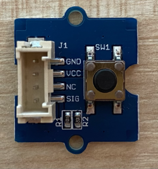
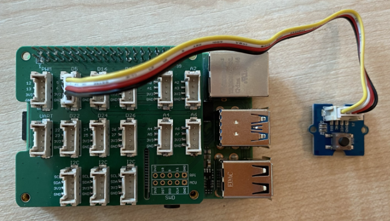

# Capture audio - Raspberry Pi

In this part of the lesson, you will write code to capture audio on your Raspberry Pi. Audio capture will be controlled by a button.

## Hardware

The Raspberry Pi needs a button to control the audio capture.

The button you will use is a Grove button. This is a digital sensor that turns a signal on or off. These buttons can be configured to send a high signal when the button is pressed, and low when it is not, or low when pressed and high when not.

If you are using a ReSpeaker 2-Mics Pi HAT as a microphone, then there is no need to connect a button as this hat has one fitted already. Skip to the next section.

### Connect the button

The button can be connected to the Grove base hat.

#### Task - connect the button



1. Insert one end of a Grove cable into the socket on the button module. It will only go in one way round.

1. With the Raspberry Pi powered off, connect the other end of the Grove cable to the digital socket marked **D5** on the Grove Base hat attached to the Pi. This socket is the second from the left, on the row of sockets next to the GPIO pins.



## Capture audio

You can capture audio from the microphone using Python code.

### Task - capture audio

1. Power up the Pi and wait for it to boot

1. Launch VS Code, either directly on the Pi, or connect via the Remote SSH extension.

1. The PyAudio Pip package has functions to record and play back audio. This package depends on some audio libraries that need to be installed first. Run the following commands in the terminal to install these:

    ```sh
    sudo apt update
    sudo apt install libportaudio0 libportaudio2 libportaudiocpp0 portaudio19-dev libasound2-plugins --yes 
    ```

1. Install the PyAudio Pip package.

    ```sh
    pip3 install pyaudio
    ```

1. Create a new folder called `smart-timer` and add a file called `app.py` to this folder.

1. Add the following imports to the top of this file:

    ```python
    import io
    import pyaudio
    import time
    import wave
    
    from grove.factory import Factory
    ```

    This imports the `pyaudio` module, some standard Python modules to handle wave files, and the `grove.factory` module to import a `Factory` to create a button class.

1. Below this, add code to create a Grove button.

    If you are using the ReSpeaker 2-Mics Pi HAT, use the following code:

    ```python
    # The button on the ReSpeaker 2-Mics Pi HAT
    button = Factory.getButton("GPIO-LOW", 17)
    ```

    This creates a button on port **D17**, the port that the button on the ReSpeaker 2-Mics Pi HAT is connected to. This button is set to send a low signal when pressed.

    If you are not using the ReSpeaker 2-Mics Pi HAT, and are using a Grove button connected to the base hat, use this code.

    ```python
    button = Factory.getButton("GPIO-HIGH", 5)
    ```

    This creates a button on port **D5** that is set to send a high signal when pressed.

1. Below this, create an instance of the PyAudio class to handle audio:

    ```python
    audio = pyaudio.PyAudio()
    ```

1. Declare the hardware card number for the microphone and speaker. This will be the number of the card you found by running `arecord -l` and `aplay -l` earlier in this lesson.

    ```python
    microphone_card_number = <microphone card number>
    speaker_card_number = <speaker card number>
    ```

    Replace `<microphone card number>` with the number of your microphones card.

    Replace `<speaker card number>` with the number of your speakers card, the same number you set in the `alsa.conf` file.

1. Below this, declare the sample rate to use for the audio capture and playback. You may need to change this depending on the hardware you are using.

    ```python
    rate = 48000 #48KHz
    ```

    If you get sample rate errors when running this code later, change this value to `44100` or `16000`. The higher the value, the better the quality of the sound.

1. Below this, create a new function called `capture_audio`. This will be called to capture audio from the microphone:

    ```python
    def capture_audio():
    ```

1. Inside this function, add the following to capture the audio:

    ```python
    stream = audio.open(format = pyaudio.paInt16,
                        rate = rate,
                        channels = 1, 
                        input_device_index = microphone_card_number,
                        input = True,
                        frames_per_buffer = 4096)

    frames = []

    while button.is_pressed():
        frames.append(stream.read(4096))

    stream.stop_stream()
    stream.close()
    ```

    This code opens an audio input stream using the PyAudio object. This stream will capture audio from the microphone at 16KHz, capturing it in buffers of 4096 bytes in size.

    The code then loops whilst the Grove button is pressed, reading these 4096 byte buffers into an array each time.

    > 💁 You can read more on the options passed to the `open` method in the [PyAudio documentation](https://people.csail.mit.edu/hubert/pyaudio/docs/).

    Once the button is released, the stream is stopped and closed.

1. Add the following to the end of this function:

    ```python
    wav_buffer = io.BytesIO()
    with wave.open(wav_buffer, 'wb') as wavefile:
        wavefile.setnchannels(1)
        wavefile.setsampwidth(audio.get_sample_size(pyaudio.paInt16))
        wavefile.setframerate(rate)
        wavefile.writeframes(b''.join(frames))
        wav_buffer.seek(0)

    return wav_buffer
    ```

    This code creates a binary buffer, and writes all the captured audio to it as a [WAV file](https://wikipedia.org/wiki/WAV). This is a standard way to write uncompressed audio to a file. This buffer is then returned.

1. Add the following `play_audio` function to play back the audio buffer:

    ```python
    def play_audio(buffer):
        stream = audio.open(format = pyaudio.paInt16,
                            rate = rate,
                            channels = 1,
                            output_device_index = speaker_card_number,
                            output = True)
    
        with wave.open(buffer, 'rb') as wf:
            data = wf.readframes(4096)
    
            while len(data) > 0:
                stream.write(data)
                data = wf.readframes(4096)
    
            stream.close()
    ```

    This function opens another audio stream, this time for output - to play the audio. It uses the same settings as the input stream. The buffer is then opened as a wave file and written to the output stream in 4096 byte chunks, playing the audio. The stream is then closed.

1. Add the following code below the `capture_audio` function to loop until the button is pressed. Once the button is pressed, the audio is captured, then played.

    ```python
    while True:
        while not button.is_pressed():
            time.sleep(.1)
        
        buffer = capture_audio()
        play_audio(buffer)
    ```

1. Run the code. Press the button and speak into the microphone. Release the button when you are done, and you will hear the recording.

    You may see some ALSA errors when the PyAudio instance is created. This is due to configuration on the Pi for audio devices you don't have. You can ignore these errors.

    ```output
    pi@raspberrypi:~/smart-timer $ python3 app.py 
    ALSA lib pcm.c:2565:(snd_pcm_open_noupdate) Unknown PCM cards.pcm.front
    ALSA lib pcm.c:2565:(snd_pcm_open_noupdate) Unknown PCM cards.pcm.rear
    ALSA lib pcm.c:2565:(snd_pcm_open_noupdate) Unknown PCM cards.pcm.center_lfe
    ALSA lib pcm.c:2565:(snd_pcm_open_noupdate) Unknown PCM cards.pcm.side
    ```

    If you see the following error:

    ```output
    OSError: [Errno -9997] Invalid sample rate
    ```

    then change the `rate` to either 44100 or 16000.

> 💁 You can find this code in the [code-record/pi](code-record/pi) folder.

😀 Your audio recording program was a success!
