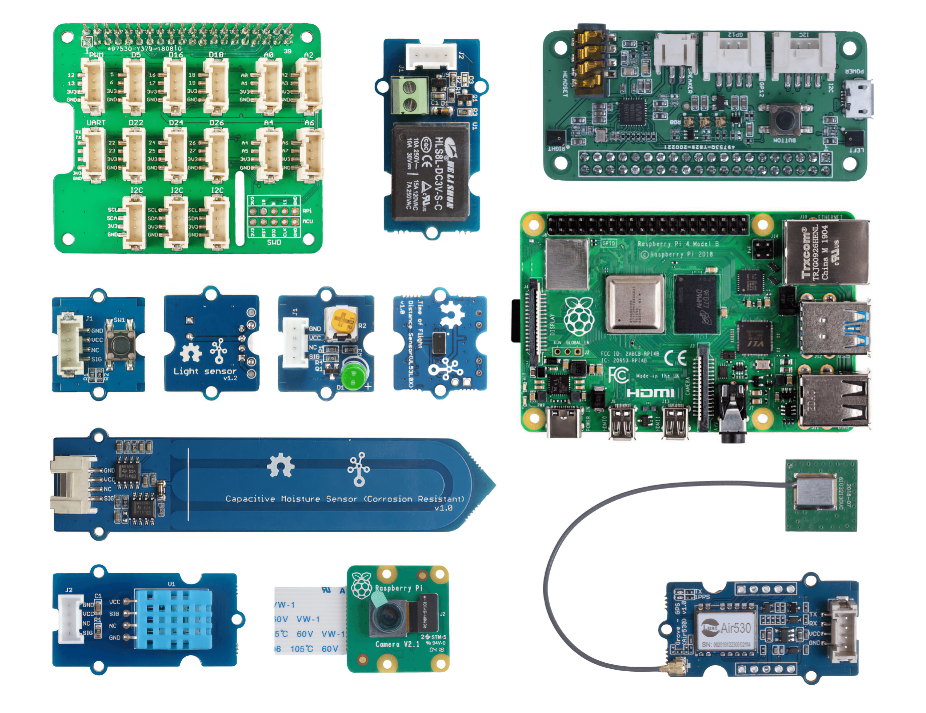

# Hardware

The **T** in IoT is **Things** and refers to devices that interact with the world around us. Each project is based on real-world hardware available to students and hobbyists. We have two choices of IoT hardware to use depending on personal preference, programming language knowledge or preferences, learning goals and availability. We have also provided a 'virtual hardware' version for those who don't have access to hardware, or want to learn more before committing to a purchase.

> 💁 You don't need to purchase any IoT hardware to complete the assignments. You can do everything using virtual IoT hardware.

The physical hardware choices are Arduino, or Raspberry Pi. Each platform has its own upsides and downsides, and these are all covered in one of the initial lessons. If you haven't already decided on a hardware platform, you can review [lesson two of the first project](./1-getting-started/lessons/2-deeper-dive/README.md) to decide which hardware platform you are most interested in learning.

The specific hardware was chosen to reduce the complexity of the lessons and assignments. Although other hardware may work, we cannot guarantee all the assignments will be supported on your device without additional hardware. For example, a lot of Arduino devices do not have WiFi, which is needed to connect to the cloud - the Wio terminal was chosen because it has WiFi built in.

You will also need a few non-technical items, such as soil or a pot plant, and fruit or vegetables.

## Buy the kits

Seeed Studios have very kindly made all the hardware available as easy to purchase kits:

### Arduino - Wio Terminal

**[IoT for beginners with Seeed and Microsoft - Wio Terminal Starter Kit](https://www.seeedstudio.com/IoT-for-beginners-with-Seeed-and-Microsoft-Wio-Terminal-Starter-Kit-p-5006.html)**

### Raspberry Pi

**[IoT for beginners with Seeed and Microsoft - Raspberry Pi 4 Starter Kit](https://www.seeedstudio.com/IoT-for-beginners-with-Seeed-and-Microsoft-Raspberry-Pi-Starter-Kit.html)**

## Arduino

All the device code for Arduino is in C++. To complete all the assignments you will need the following:

### Arduino hardware

* [Wio Terminal](https://www.seeedstudio.com/Wio-Terminal-p-4509.html)
* *Optional* - USB-C cable or USB-A to USB-C adapter. The Wio terminal has a USB-C port and comes with a USB-C to USB-A cable. If your PC or Mac only has USB-C ports you will need a USB-C cable, or a USB-A to USB-C adapter.

### Arduino specific sensors and actuators

These are specific to using the Wio terminal Arduino device, and are not relevant to using the Raspberry Pi.

* [ArduCam Mini 2MP Plus - OV2640](https://www.arducam.com/product/arducam-2mp-spi-camera-b0067-arduino/)
* [ReSpeaker 2-Mics Pi HAT](https://www.seeedstudio.com/ReSpeaker-2-Mics-Pi-HAT.html)
* [Breadboard Jumper Wires](https://www.seeedstudio.com/Breadboard-Jumper-Wire-Pack-241mm-200mm-160mm-117m-p-234.html)
* Headphones or other speaker with a 3.5mm jack, or a JST speaker such as:
  * [Mono Enclosed Speaker - 2W 6 Ohm](https://www.seeedstudio.com/Mono-Enclosed-Speaker-2W-6-Ohm-p-2832.html)
  * [Grove speaker plus](https://www.seeedstudio.com/Grove-Speaker-Plus-p-4592.html)
* *Optional* - microSD Card 16GB or less for testing image capture, along with a connector to use the SD card with your computer if you don't have one built-in. **NOTE** - the Wio Terminal only supports SD cards up to 16GB, it does not support higher capacities.

## Raspberry Pi

All the device code for Raspberry Pi is in Python. To complete all the assignments you will need the following:

### Raspberry Pi hardware

* [Raspberry Pi](https://www.raspberrypi.org/products/raspberry-pi-4-model-b/)
  > 💁 Versions from the Pi 2B and above should work with the assignments in these lessons.
* microSD Card (You can get Raspberry Pi kits that come with a microSD Card), along with a connector to use the SD card with your computer if you don't have one built-in.
* USB power supply (You can get Raspberry Pi 4 kits that come with a power supply). If you are using a Raspberry Pi 4 you need a USB-C power supply, earlier devices need a micro-USB power supply.

### Raspberry Pi specific sensors and actuators

These are specific to using the Raspberry Pi, and are not relevant to using the Arduino device.

* [Grove Pi base hat](https://www.seeedstudio.com/Grove-Base-Hat-for-Raspberry-Pi.html)
* [Raspberry Pi Camera module](https://www.raspberrypi.org/products/camera-module-v2/)
* Microphone and speaker:

  Use one of the following (or equivalent):
  * Any USB Microphone with any USB speaker, or speaker with a 3.5mm jack cable, or using HDMI audio output if your Raspberry Pi is connected to a monitor or TV with speakers
  * Any USB headset with a built in microphone
  * [ReSpeaker 2-Mics Pi HAT](https://www.seeedstudio.com/ReSpeaker-2-Mics-Pi-HAT.html) with
    * Headphones or other speaker with a 3.5mm jack, or a JST speaker such as:
    * [Mono Enclosed Speaker - 2W 6 Ohm](https://www.seeedstudio.com/Mono-Enclosed-Speaker-2W-6-Ohm-p-2832.html)
  * [USB Speakerphone](https://www.amazon.com/USB-Speakerphone-Conference-Business-Microphones/dp/B07Q3D7F8S/ref=sr_1_1?dchild=1&keywords=m0&qid=1614647389&sr=8-1)
* [Grove Light sensor](https://www.seeedstudio.com/Grove-Light-Sensor-v1-2-LS06-S-phototransistor.html)
* [Grove button](https://www.seeedstudio.com/Grove-Button.html)

## Sensors and actuators

Most of the sensors and actuators needed are used by both the Arduino and Raspberry Pi learning paths:

* [Grove LED](https://www.seeedstudio.com/Grove-LED-Pack-p-4364.html) x 2
* [Grove humidity and temperature sensor](https://www.seeedstudio.com/Grove-Temperature-Humidity-Sensor-DHT11.html)
* [Grove capacitive soil moisture sensor](https://www.seeedstudio.com/Grove-Capacitive-Moisture-Sensor-Corrosion-Resistant.html)
* [Grove relay](https://www.seeedstudio.com/Grove-Relay.html)
* [Grove GPS (Air530)](https://www.seeedstudio.com/Grove-GPS-Air530-p-4584.html)
* [Grove Time of flight Distance Sensor](https://www.seeedstudio.com/Grove-Time-of-Flight-Distance-Sensor-VL53L0X.html)

## Optional hardware

The lessons on automated watering work using a relay. As an option, you can connect this relay to a water pump powered by USB using the hardware listed below.

* [6V water pump](https://www.seeedstudio.com/6V-Mini-Water-Pump-p-1945.html)
* [USB terminal](https://www.adafruit.com/product/3628)
* Silicone pipes
* Red and black wires
* Small flat-head screwdriver

## Virtual hardware

The virtual hardware route will provide simulators for the sensors and actuators, implemented in Python. Depending on your hardware availability, you can run this on your normal development device, such as a Mac, PC, or run it on a Raspberry Pi and simulate only the hardware you don't have. For example, if you have the Raspberry Pi camera but not the Grove sensors, you will be able to run the virtual device code on your Pi and simulate the Grove sensors, but use a physical camera.

The virtual hardware will use the [CounterFit project](https://github.com/CounterFit-IoT/CounterFit).

To complete these lessons you will need to have a web cam, microphone and audio output such as speakers or headphones. These can be built in or external, and need to be configured to work with your operating system and available for use from all applications.
